# Tenangin App 🌿

**Tenangin** adalah sebuah aplikasi *mobile* yang berfokus pada kesehatan mental dan kesejahteraan emosional penggunanya. Aplikasi ini didesain sebagai ruang aman (safe space) bagi pengguna untuk mendapatkan dukungan emosional, membaca afirmasi positif harian, berbagi cerita secara anonim atau publik di forum komunitas, serta menonton video edukasi dan relaksasi.

Proyek ini dikembangkan sebagai bentuk pemenuhan tugas **Ujian Akhir Semester (UAS) Mata Kuliah Mobile Computing**.

---

## 🔗 Tautan Penting
- **Desain UI/UX (Figma):** [Tenangin App Design](https://www.figma.com/design/CQIr4hUXvJDOurfzkp16KW/Tenangin-App?node-id=1-16916&t=HwNnRGFx85OZlpUd-1)
- **Repository Backend:** [Tenangin Backend API](https://github.com/syahrul-awaludin/Tenangin-Backend)

---

## 🚀 User Flow (Alur Pengguna)
1. **Onboarding / Auth**: Saat pertama kali membuka aplikasi, sistem akan mengecek *Local Storage*. Jika token sesi belum ada, pengguna diarahkan ke layar **Login** atau **Register**.
2. **Beranda (Home)**: Setelah berhasil login, pengguna akan masuk ke halaman Home yang menampilkan sapaan personal dan kartu afirmasi harian yang menenangkan.
3. **Eksplorasi (Learn)**: Pengguna dapat berpindah ke tab "Learn" untuk mencari dan menonton berbagai video relaksasi / edukasi mental.
4. **Interaksi (Community)**: Pengguna dapat masuk ke tab "Community" untuk membaca pengalaman pengguna lain (*fetch* dari API), memberikan *Like*, menulis komentar, atau membuat postingan baru.
5. **Notifikasi**: Sesekali aplikasi dapat memunculkan notifikasi lokal untuk mengingatkan pengguna beristirahat atau meditasi.

---

## ✨ Fitur Utama (Minimum Viable Product UAS)

### 1. Sistem Autentikasi (API Terintegrasi)
- **Login & Register**: Pengguna membuat akun menggunakan REST API. Keamanan dijamin melalui proses *hashing* password dan penggunaan token **JWT (JSON Web Token)** di backend.
- **Auto-Login**: Menggunakan *Shared Preferences*, token disimpan di perangkat pengguna, membebaskan pengguna dari keharusan *login* berulang setiap kali membuka aplikasi.

### 2. Community Forum (REST API)
- **Mendukung fitur Create, Read, Update, Delete (CRUD)** untuk memfasilitasi forum komunitas Tenangin.
- Mengambil (*fetch*) daftar postingan terbaru (List Data) secara *real-time* dari Backend REST API.
- Fitur interaktif: *Create Post*, *Like Post*, dan *Comment* yang tersinkronisasi langsung ke *database* di server VPS.

### 3. Learn & Meditate (Video Player)
- Kumpulan konten multimedia (*video playback*) untuk mendukung meditasi dan relaksasi visual pengguna.

### 4. Real-time Interactions (WebSocket)
- **Notifikasi *In-App* Instan**: Mendapatkan *alert* (pop-down) secara *real-time* tanpa *refresh* jika ada pengguna lain yang menyukai atau mengomentari postingan.
- **Pembaruan UI Live**: Angka jumlah *Like* dan *Comment* pada halaman Komunitas berubah secara langsung seiring interaksi yang terjadi di *backend*.

### 5. Local Notification (Mobile Feature)
- Mengimplementasikan pemberitahuan (*push alert*) berbasis sistem internal perangkat (*local*) menggunakan `flutter_local_notifications` tanpa membutuhkan layanan *cloud messaging* eksternal.

---

## 🛠 Arsitektur & Struktur Direktori

Aplikasi ini menerapkan pemisahan tanggung jawab (*Separation of Concerns*) dengan menggunakan pola arsitektur **Model-View-Controller (MVC)** pada sisi *Frontend* (Flutter).

```text
lib/
 ├── controllers/        # Logika bisnis dan State Management (Provider)
 │   ├── auth_controller.dart
 │   └── community_controller.dart
 ├── models/             # Struktur data berorientasi objek (OOP) untuk mapping JSON API
 │   ├── post_model.dart
 │   ├── user_model.dart
 │   └── comment_model.dart
 ├── services/           # Interaksi ke luar sistem (HTTP REST API, WebSocket & Notifikasi)
 │   ├── api_client.dart
 │   ├── socket_service.dart
 │   └── notification_service.dart
 ├── theme/              # Design System (Warna, Tipografi, Style Global)
 │   ├── app_colors.dart
 │   └── app_typography.dart
 ├── views/              # Halaman UI/UX (Hanya fokus pada presentasi visual)
 │   ├── auth/
 │   ├── community/
 │   └── home/
 └── widgets/            # Komponen UI kecil yang dapat digunakan ulang (Reusable)
```

---

## 💻 Tech Stack & Dependencies

**Sistem Keseluruhan:**
- **Frontend (Mobile)**: Flutter (Dart) — Framework UI tangguh dari Google untuk membangun aplikasi *multi-platform* (*Android, iOS, macOS, dll.*) secara *native* dengan satu basis kode (codebase).
- **Backend (API)**: Node.js dengan framework Express.js — Digunakan untuk membuat arsitektur *RESTful API* dan *WebSocket server* secara *asynchronous* yang ringan dan cepat.
- **Database Backend**: MySQL & Prisma ORM — Penyimpanan relasional yang solid, dikelola secara terstruktur dengan *schema-based* ORM Prisma.
- **Deployment**: Virtual Private Server (VPS) menggunakan OS Ubuntu & PM2 sebagai *process manager* agar API tetap berjalan (uptime 24/7).

**Library & Package Utama (Flutter):**
- **`provider`**: Paket wajib untuk *State Management*. Memisahkan logika pengelolaan data (bisnis) dari *widget tree*, serta menyuruh Flutter untuk hanya me-*render* ulang UI pada bagian komponen yang nilainya berubah (*reactivity* yang efisien).
- **`http`**: *Network library* bawaan yang ringan untuk mengelola proses pengambilan atau pengiriman data (*CRUD*) secara asinkronus dengan Backend REST API.
- **`shared_preferences`**: Berperan sebagai **Local Storage** (mirip *cookie/localStorage* di web) untuk menyimpan data esensial yang persisten meskipun aplikasi ditutup (misalnya menyimpan sesi `auth_token` agar pengguna tidak perlu *login* setiap kali masuk).
- **`flutter_local_notifications`**: Berfungsi untuk menjadwalkan dan memunculkan notifikasi *pop-up* standar berbasis sistem perangkat keras lokal (baik di Android/iOS/macOS) secara luring (*offline*) tanpa membutuhkan layanan *cloud messaging* seperti Firebase FCM.
- **`socket_io_client`**: Sebuah *client socket* untuk membuka jalur komunikasi dua arah berkelanjutan (Full-Duplex) dengan *backend*. Digunakan untuk mendengarkan perubahan data (contohnya angka jumlah *Like/Comment* bertambah) dan menembak *event* baru langsung ke layar dalam sepersekian detik.
- **`overlay_support`**: Ekstensi visual untuk merender notifikasi atau *snackbars* yang melayang (overlay) di urutan paling depan *widget tree*. Sangat berguna untuk membungkus *alert* notifikasi instan dari WebSocket agar terlihat menarik tanpa memedulikan di halaman mana pengguna sedang berada.
- **`image_picker`**: Plugin resmi Flutter yang memanggil jendela *Native* sistem HP untuk memilih berkas foto dari Galeri lokal atau memicu kamera bawaan (berguna untuk fitur unggah foto profil, dsb.).
- **`video_player` & `youtube_player_iframe`**: Modul pemutar media yang merender bingkai (frame) video langsung di dalam UI Flutter, yang mendukung fitur multimedia relaksasi di menu *Learn*.

---

## ⚙️ Cara Menjalankan Aplikasi (Local Setup)

1. Pastikan komputer Anda telah terinstal **Flutter SDK** versi terbaru.
2. *Clone* repository ini:
   ```bash
   git clone https://github.com/syahrul-awaludin/UTS-Mobile-Computing-Tenangin-App.git
   ```
3. Masuk ke dalam direktori aplikasi:
   ```bash
   cd UTS-Mobile-Computing-Tenangin-App
   ```
4. Unduh semua paket (dependencies):
   ```bash
   flutter pub get
   ```
5. Jalankan aplikasi pada *Emulator* atau *Device Fisik*:
   ```bash
   flutter run
   ```

---

## 📱 Screenshot Aplikasi

Berikut adalah pratinjau antarmuka pengguna (UI) dari aplikasi Tenangin:

### 1. Onboarding & Autentikasi
<p align="center">
  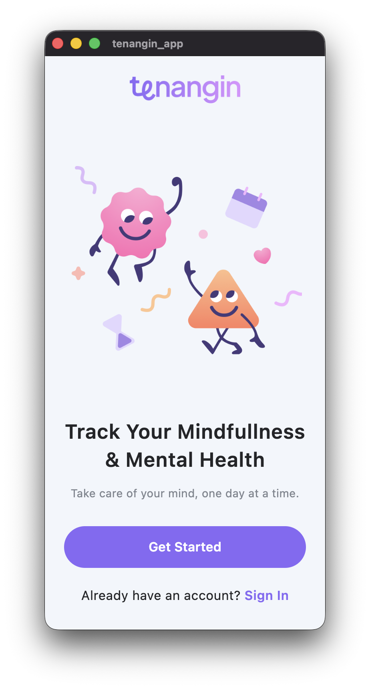
  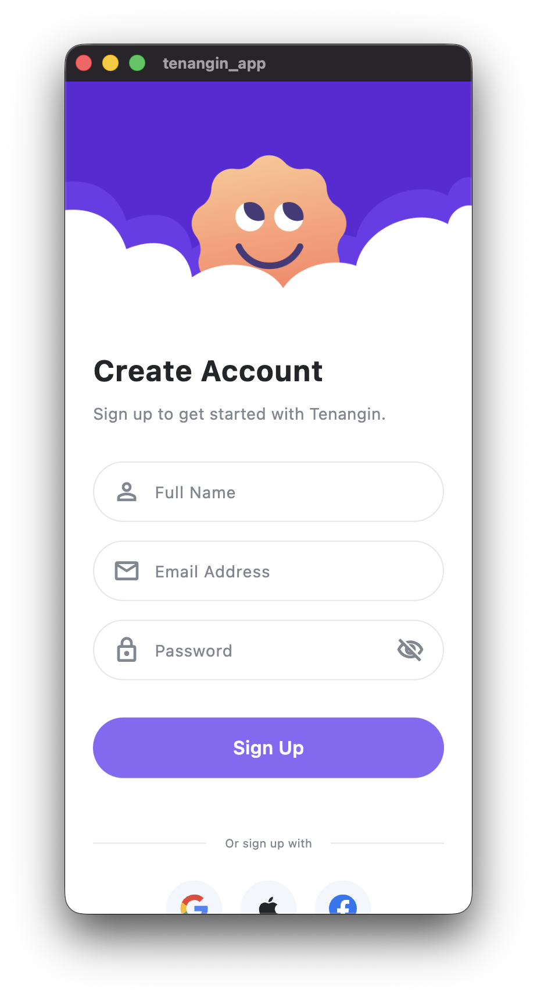
  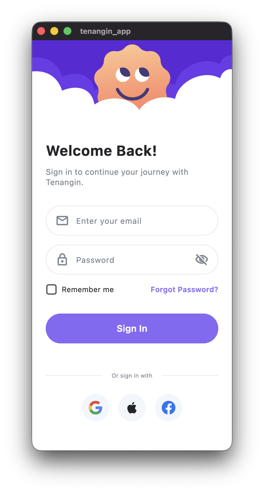
</p>

### 2. Beranda & Eksplorasi Edukasi (Learn)
<p align="center">
  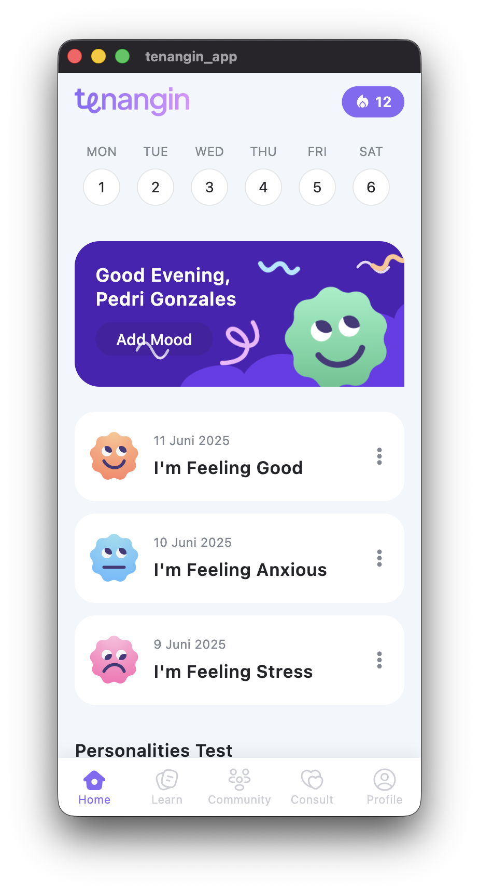
  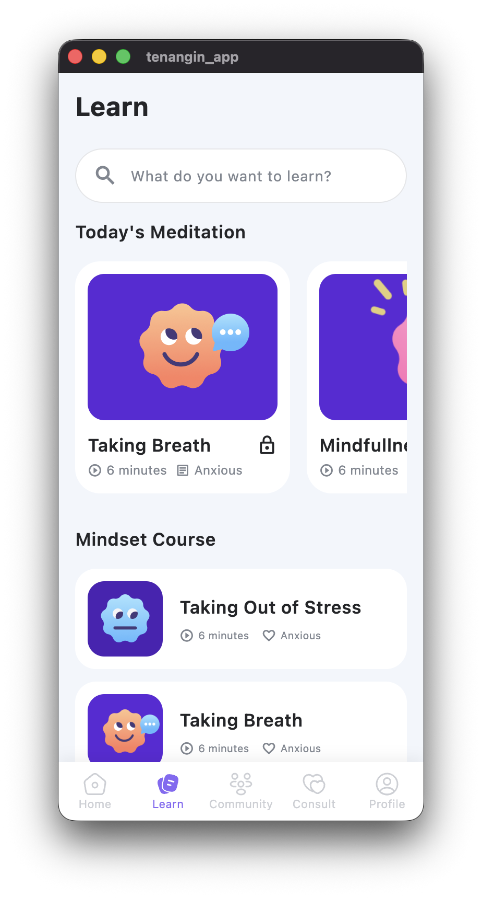
  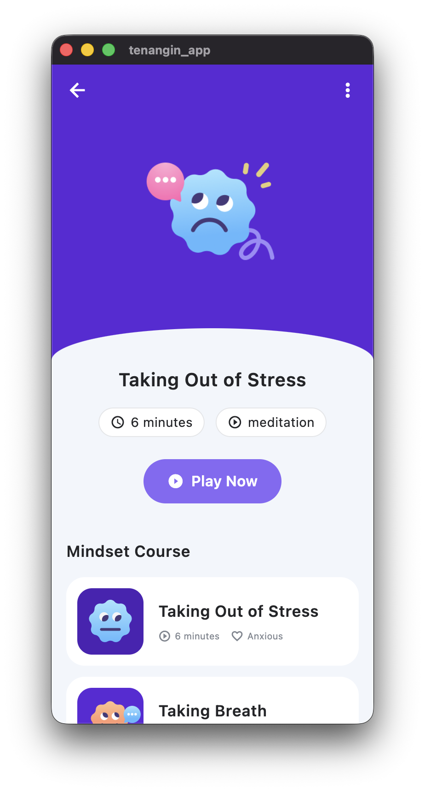
  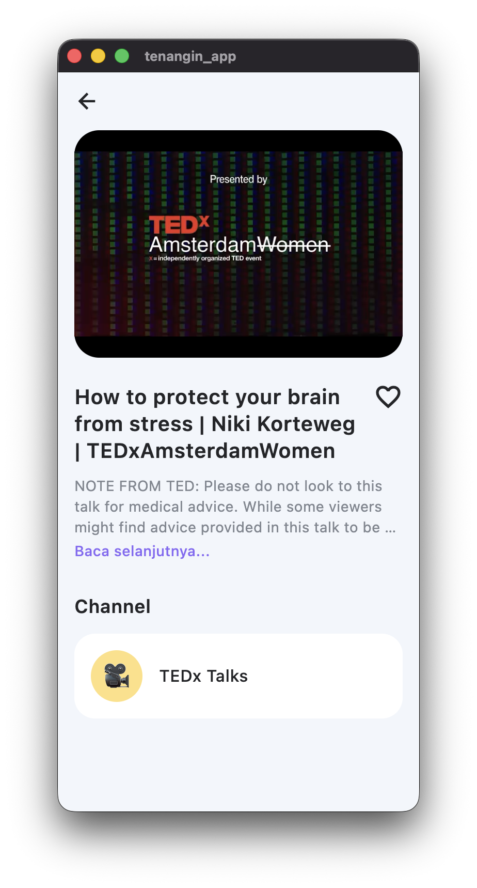
</p>

### 3. Komunitas (Ruang Aman)
<p align="center">
  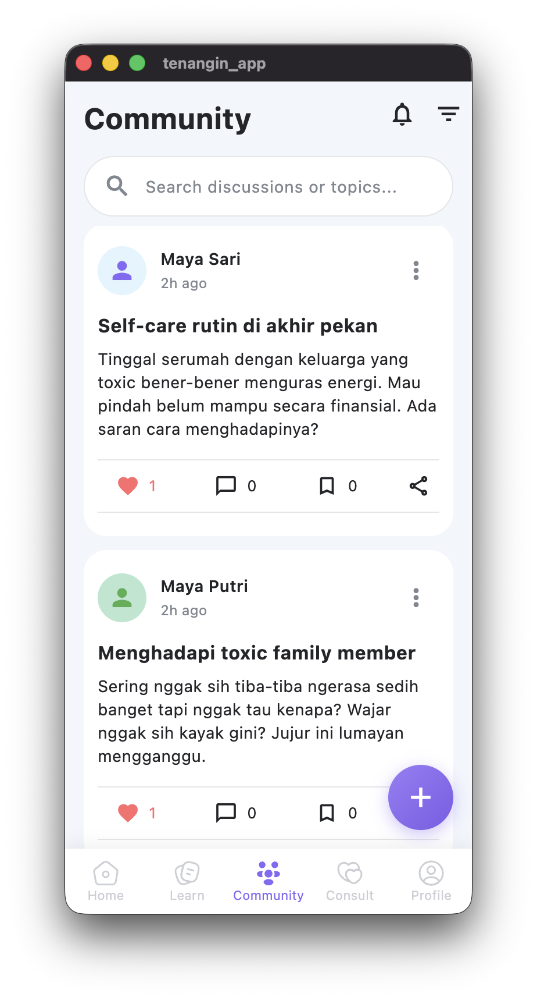
  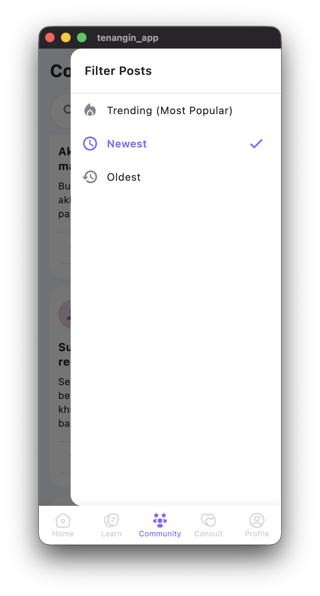
  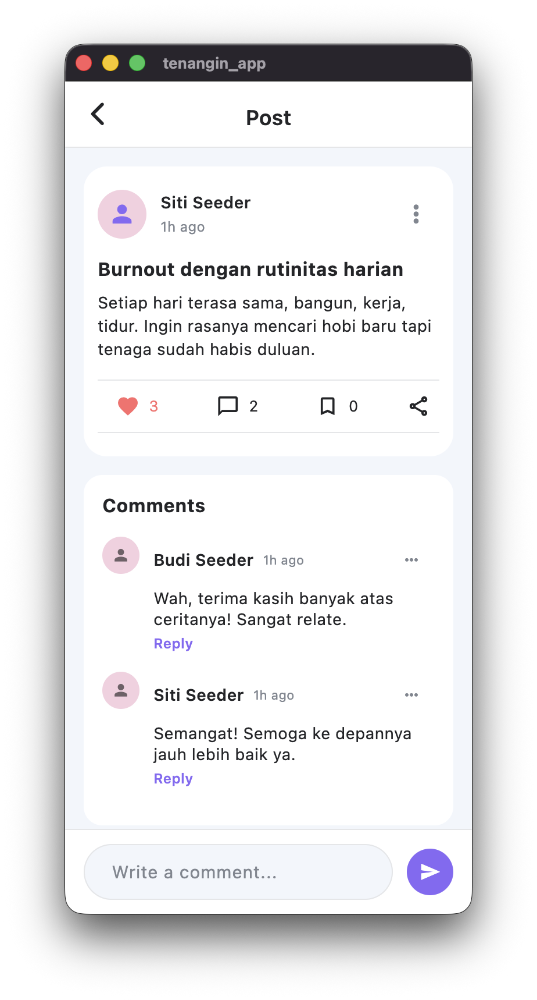
  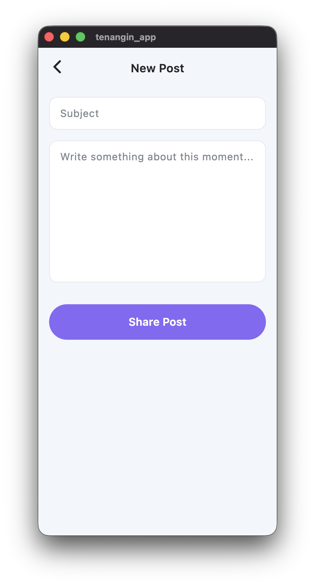
</p>

### 4. Notifikasi & Interaksi Real-time
<p align="center">
  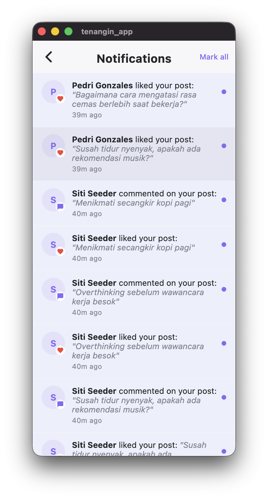
</p>

---
*Dibuat dan dirancang oleh Syahrul Awaludin untuk UAS Mobile Computing 2026*
