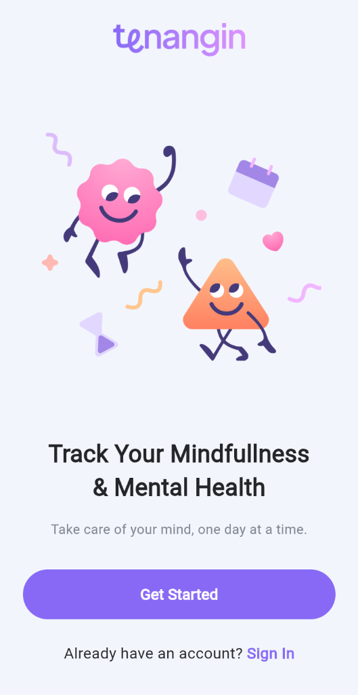
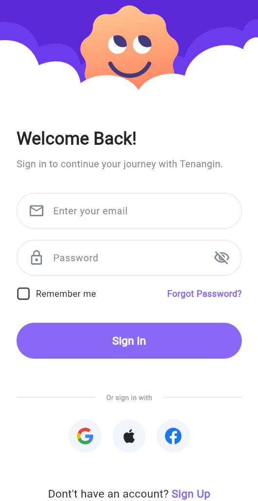
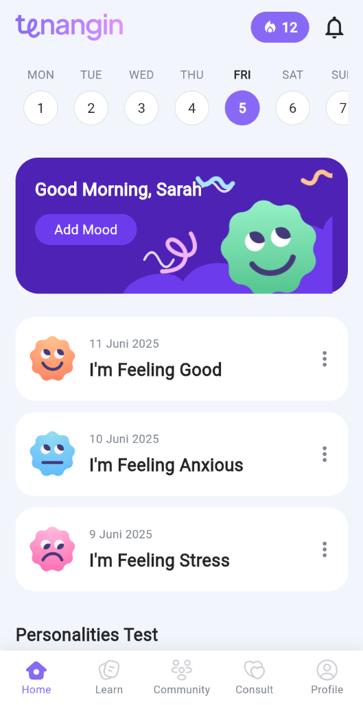
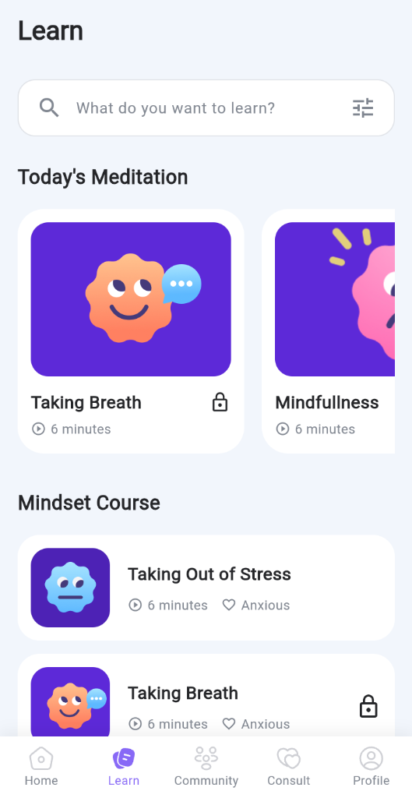
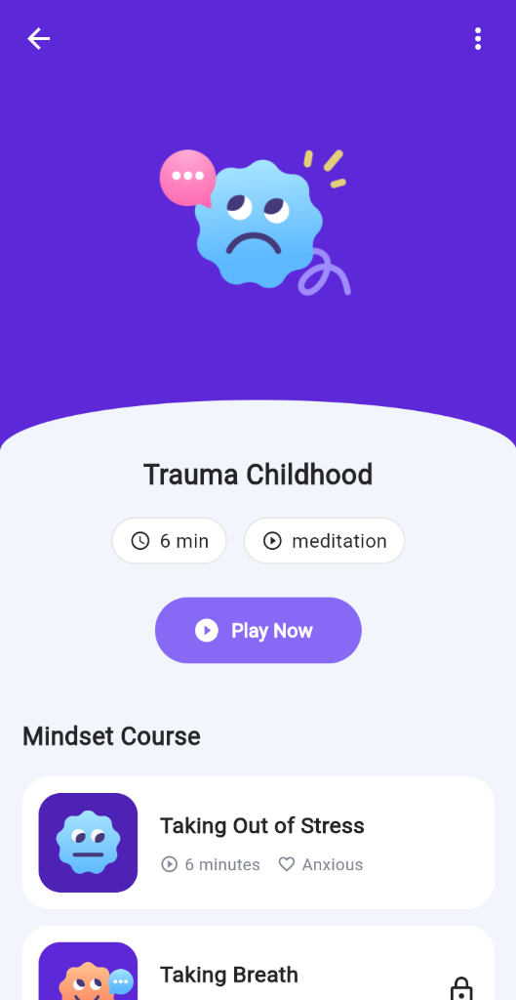
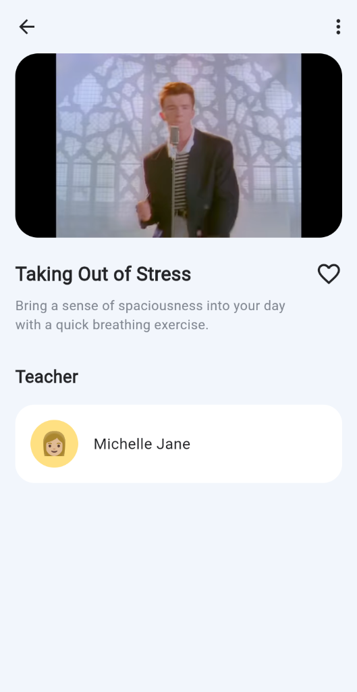

<div align="center">

<!-- HERO BANNER -->


<br/>


<br/>

<p>
  <a href="https://flutter.dev"></a>&nbsp;
  <a href="https://dart.dev"></a>&nbsp;
  <a href="LICENSE"></a>&nbsp;
  
</p>

<p>
  
  &nbsp;
  
  &nbsp;
  
</p>

</div>

<br/>


<br/>

## 🌿 &nbsp;Tentang Tenangin


**Tenangin** adalah aplikasi mobile modern yang hadir untuk menemanimu menjaga kesehatan mental sehari-hari. Didesain dengan antarmuka yang elegan, animasi yang menenangkan, dan konten yang bermakna.

<br/>

```
  😌  Afirmasi positif setiap pagi
  📊  Lacak mood & emosi harianmu
  🌬️  Latihan pernapasan & mindfulness
  📚  Konten edukatif kesehatan mental
  🤝  Komunitas yang suportif & hangat
```

<br/>

> 💬 *"Kesehatan mental bukan kemewahan — itu kebutuhan dasar setiap manusia."*

<br/>


<br/>

## 📱 &nbsp;Screenshots

<div align="center">

<br/>

<table>
  <tr>
    <th align="center">🌅 Onboarding</th>
    <th align="center">🔐 Sign In</th>
    <th align="center">🏠 Home</th>
  </tr>
  <tr>
    <td align="center">
      <br/><br/>
      <b>Halaman Pembuka</b><br/>
      <sub>Ilustrasi karakter yang ceria dengan tagline <br/><i>"Track Your Mindfulness & Mental Health"</i>.<br/>Tombol <b>Get Started</b> & link <b>Sign In</b>.</sub>
    </td>
    <td align="center">
      <br/><br/>
      <b>Halaman Masuk</b><br/>
      <sub>Form login dengan email & password.<br/>Dukungan sign-in via <b>Google</b>, <b>Apple</b>,<br/>dan <b>Facebook</b>.</sub>
    </td>
    <td align="center">
      <br/><br/>
      <b>Beranda Utama</b><br/>
      <sub>Kalender mingguan, banner mood tracker,<br/>riwayat mood harian, dan<br/>section <b>Personalities Test</b>.</sub>
    </td>
  </tr>
  <tr>
    <th align="center">📚 Learn</th>
    <th align="center">📖 Detail Kelas</th>
    <th align="center">🎬 Video Player</th>
  </tr>
  <tr>
    <td align="center">
      <br/><br/>
      <b>Halaman Belajar</b><br/>
      <sub>Search bar, koleksi <b>Today's Meditation</b>,<br/>dan daftar <b>Mindset Course</b><br/>yang bisa diakses langsung.</sub>
    </td>
    <td align="center">
      <br/><br/>
      <b>Detail Materi</b><br/>
      <sub>Cover kelas dengan ilustrasi emosi,<br/>judul sesi, durasi, kategori,<br/>dan tombol <b>Play Now</b>.</sub>
    </td>
    <td align="center">
      <br/><br/>
      <b>Pemutar Video</b><br/>
      <sub>Embedded YouTube player dengan<br/>judul konten, deskripsi sesi,<br/>dan profil instruktur pengajar.</sub>
    </td>
  </tr>
</table>

</div>

<br/>


<br/>

## ✨ &nbsp;Fitur Utama

<div align="center">

<table>
  <tr>
    <td align="center" width="210">
      <br/>
      <br/><br/>
      <sub>Catat mood harianmu & pantau<br/>perjalanan emosional dari waktu ke waktu</sub>
      <br/><br/>
    </td>
    <td align="center" width="210">
      <br/>
      <br/><br/>
      <sub>Mulai hari dengan kalimat positif<br/>yang memberdayakan & memotivasi</sub>
      <br/><br/>
    </td>
    <td align="center" width="210">
      <br/>
      <br/><br/>
      <sub>Latihan pernapasan & sesi<br/>mindfulness terpandu setiap hari</sub>
      <br/><br/>
    </td>
  </tr>
  <tr>
    <td align="center" width="210">
      <br/>
      <br/><br/>
      <sub>Video YouTube & artikel kesehatan<br/>mental yang terkurasi berkualitas</sub>
      <br/><br/>
    </td>
    <td align="center" width="210">
      <br/>
      <br/><br/>
      <sub>Terhubung & berbagi cerita<br/>bersama komunitas yang suportif</sub>
      <br/><br/>
    </td>
    <td align="center" width="210">
      <br/>
      <br/><br/>
      <sub>Antarmuka modern & elegan<br/>dengan animasi yang menenangkan</sub>
      <br/><br/>
    </td>
  </tr>
</table>

</div>

<br/>


<br/>

## 🛠️ &nbsp;Tech Stack

<div align="center">

<br/>


<br/><br/>

| Package | Versi | Kegunaan |
|:---|:---:|---|
| [`flutter_svg`](https://pub.dev/packages/flutter_svg) | `^2.0.10` | Render icon & aset SVG |
| [`youtube_player_iframe`](https://pub.dev/packages/youtube_player_iframe) | latest | Embed & putar video YouTube |
| [`cupertino_icons`](https://pub.dev/packages/cupertino_icons) | `^1.0.8` | Icon set bergaya iOS |
| [`provider`](https://pub.dev/packages/provider) | latest | State Management (Clean Architecture) |
| [`http`](https://pub.dev/packages/http) | latest | Klien REST API terpusat (`ApiClient`) |
| [`shared_preferences`](https://pub.dev/packages/shared_preferences) | latest | Penyimpanan JWT & Refresh Token lokal |

</div>

<br/>


<br/>

## 🚀 &nbsp;Getting Started

### 📋 &nbsp;Prasyarat

<div align="center">

| Tool | Versi |
|:---:|:---:|
|  | `^3.x` |
|  | `^3.x` |
|  | Latest |

</div>

<br/>

### ⚡ &nbsp;Instalasi Cepat

```bash
# 🍴 Clone repository
git clone https://github.com/syahrul-awaludin/UTS-Mobile-Computing-Tenangin-App.git

# 📁 Masuk ke direktori
cd UTS-Mobile-Computing-Tenangin-App

# 📦 Install dependencies
flutter pub get

# ▶️  Jalankan aplikasi
flutter run
```

<br/>


<br/>

## 🤝 &nbsp;Kontribusi

```
1. 🍴  Fork repository ini
2. 🌿  Buat branch baru      →  git checkout -b feature/nama-fitur
3. 💾  Commit perubahan      →  git commit -m 'feat: deskripsi fitur'
4. 🚀  Push ke branch        →  git push origin feature/nama-fitur
5. 🔀  Buat Pull Request
```

<br/>


<br/>

## 📄 &nbsp;Lisensi

Proyek ini bersifat open-source dan tersedia di bawah lisensi **[MIT](LICENSE)**.

<br/>


<br/>

## 👨‍💻 &nbsp;Author

<div align="center">

<br/>


<br/>

[](https://github.com/syahrul-awaludin)

<br/>

</div>

<!-- FOOTER WAVE -->


<div align="center">


</div>
